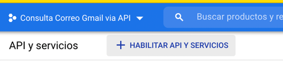
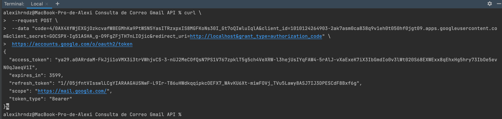

**Consulta de correos vía Gmail API**

Se procede a realizar consulta de correos vía Gmail API, con una configuración previa en Google Cloud Platform.

En este proyecto solo se implementa una clase GmailAPI, que contiene la estructura necesaria para recuperar distintos datos de un correo a consultar, inicialmente con el método getMailByBody el cual lee la bandeja de entrada de los correos indicados y devuelve un objeto tipo Message con los datos del correo más reciente que tiene en su cuerpo un String que recibe como parámetro de entrada 

Para esto es necesario realizar previamente una configuración en Google Cloud Platform para obtener 3 datos que nos serviran de credenciales para el acceso al correo vía API's

- refresh.token
- client.id
- client.secret

Con estos datos la clase GmailAPI es capaz de actualizar en cada consulta el access_token de la cuenta para realizar la consulta

Para obtener estos datos se debe seguir el siguiente procedimiento manual 

1. Ingrese al suguiente enlace: https://console.cloud.google.com/home

Con las credenciales de la cuenta de correos a consultar

2. Al estar en el home crea un proyecto con la descripcion deseada:

3. Ingresa a la sección de API's

4. Habilita Gmail API

Te enviará al dashboard de tu proyecto

5. Crea nuevas credenciales

_En la pantalla de permisos y usuarios de prueba no se modifica nada_

_En la pantalla de consentimiento se debe publicar la Aplicación_

6. Volver a credenciales 

**IMPORTANTE**
   

**Se generan los primeros datos para el acceso al correo**

client.id y client.secret

Puedes descargar el json si lo deseas, en este proyecto los datos van por properties

**Comandos: se recomienda copiar los datos a partir de la información en la ruta _resources/comandos.txt_**

7. Una vez contamos con estos datos se procede a generar un dato previo para luego genrar el refresh.token

    Desde el explorador cargamos la siguiente petición

`
https://accounts.google.com/o/oauth2/v2/auth?
scope=https://mail.google.com/&
access_type=offline&
include_granted_scopes=true&
state=state_parameter_passthrough_value&
redirect_uri=http://localhost&
response_type=code&
client_id=[cliente.id]`

Cambiando `[cliente.id]` por nuestro client.id obtenido en el registro previo

Mostrará una pantalla de autorización que debes aceptar

Muestra el siguiente mensaje (No afecta)

Debemos buscar la respuesta en la barra de direcciones del explorador va a mostrar algo como esto:

http://localhost/?state=state_parameter_passthrough_value&code=4/0AX4XfWhvpOqhUHee7dcacRzUoBgwFUzBSDcLR4lOK_l9pz_Hl_WeBYtU8Hw67IM0MRKPKg&scope=https://mail.google.com/

De donde debemos extraer la cade de **code** para este caso

code=**_4/0AX4XfWhvpOqhUHee7dcacRzUoBgwFUzBSDcLR4lOK_l9pz_Hl_WeBYtU8Hw67IM0MRKPKg_**

8. En el próximo paso procedemos a hacer una petición **curl** desde la línea de comandos

Ajustando los datos **[codeAnterior], [client.id] y [cliente.secret]**

`curl \
--request POST \
--data "code=[codeAnterior]&client_id=[client.id]&client_secret=[cliente.secret]&redirect_uri=http://localhost&grant_type=authorization_code" \
https://accounts.google.com/o/oauth2/token`

Debe quedar así:

curl \
 --request POST \
 --data "code=4/0AX4XfWhvpOqhUHee7dcacRzUoBgwFUzBSDcLR4lOK_l9pz_Hl_WeBYtU8Hw67IM0MRKPKg&client_id=1010124264903-2ak7asm0ca838q9v1eh0t050hf0jgt09.apps.googleusercontent.com&client_secret=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&redirect_uri=http://localhost&grant_type=authorization_code" \ 
 https://accounts.google.com/o/oauth2/token

Esta es la respuesta 

De donde obtenemos nuestro refresh.token, en este ejemplo:

`"refresh_token": "1//05jfntVIsswlLCgYIARAAGAUSNwF-L9Ir-T86uHWdkqqipkcOEFX7_WAvKU6Xt-miwFOVj_TVu5Lawy8ASJ7IJ3DPESCdF8Bxf6g"`

**Ejemplo:**

A modo de ejemplo se implementa la clase ConsultaCorreoGmail donde se muestra una manera de implementar los properties para la autenticación, solo se deben modificar los valores de las línea 22, 24 y 25 con los datos obtenidos en el procedimiento manual 

Al ejecutar el método main de esa clase se llama inicialmente al método `getGmailService()` el cual establece la conexión con el Gmail API y la cuenta de correos de las credenciales definidas, posteriormente con el método `getMailByBody("Recuperar Contraseña")` este devuelve el correo más reciente donde el cuerpo del correo contenga esa cadena, por ejemplo

***************************************************************************************

Task :ConsultarCorreoGmail.main()
Email Date: Sat, 25 Sep 2021 09:12:20 -0500

Email body:

---------- Forwarded message ---------
De: <notificaciones@banistmo.com>
Date: lun, 20 de sep. de 2021 a la(s) 13:12
Subject: Notificaciones Banistmo
To: <TESTQABANISTMOSVP@gmail.com>

[image: Banner]

[image: Banner]

Alertas y Notificaciones
* Recuperar Contraseña *

Hola,

Banistmo te informa que podrás completar tú recuperación de contraseña en
nuestros canales digitales con el siguiente dato:

*Código de verificación:* * ED6NU93T*

Recuerda que este código tiene una vigencia de 5 minutos. De no poder
ingresarlo tendrás que solicitarlo nuevamente iniciando el proceso de
Olvido usuario.

[image: Bancolombia]

El contenido de este mensaje y de los archivos adjuntos está dirigido
exclusivamente a sus destinatarios y puede contener información
privilegiada o confidencial. Si usted no es el destinatario real, por favor
informe de ello a nuestra Sucursal Telefónica a (507) 306-4700 y elimine
este mensaje de inmediato, de tal manera que no pueda acceder a el
nuevamente. Está prohibida su retención, grabación, utilización o
divulgación con cualquier propósito. Banistmo nunca enviará correos
electrónicos solicitando confirmar, validar o actualizar información
confidencial relacionada con sus cuentas, claves de acceso, PIN, números de
tarjetas de crédito, ni de débito. Si recibe un correo que le solicite
estos datos, por favor no lo conteste y proceda a reportarlo al (507)
306-4700. Si tiene alguna inquietud podrá contactarnos en nuestra Sucursal
Telefónica al (507) 306-4700.
[image: Facebook] <https://www.facebook.com/Banistmo/> [image: Twitter]
<https://twitter.com/Banistmo> [image: Lindekin]
<https://www.linkedin.com/company/banistmo> [image: Instagram]
<https://www.instagram.com/banistmo/> [image: Youtube]
<https://www.youtube.com/banistmo>

Deprecated Gradle features were used in this build, making it incompatible with Gradle 7.0.
Use '--warning-mode all' to show the individual deprecation warnings.
See https://docs.gradle.org/6.8/userguide/command_line_interface.html#sec:command_line_warnings

BUILD SUCCESSFUL in 4s
4 actionable tasks: 2 executed, 2 up-to-date
6:31:05 p.m.: Task execution finished 'ConsultarCorreoGmail.main()'.

***************************************************************************************

**En el siguiente enlace pueden realizar una consulta más exhaustiva de como manejar los Objetos Message de Gmail**

https://developers.google.com/gmail/api/reference/rest/v1/users.messages

Nota adicional: en la consola de Google Cloud Platform se pueden general credenciales adicionales para el mismo correo y se pueden consultar estadísticas de los accesos

